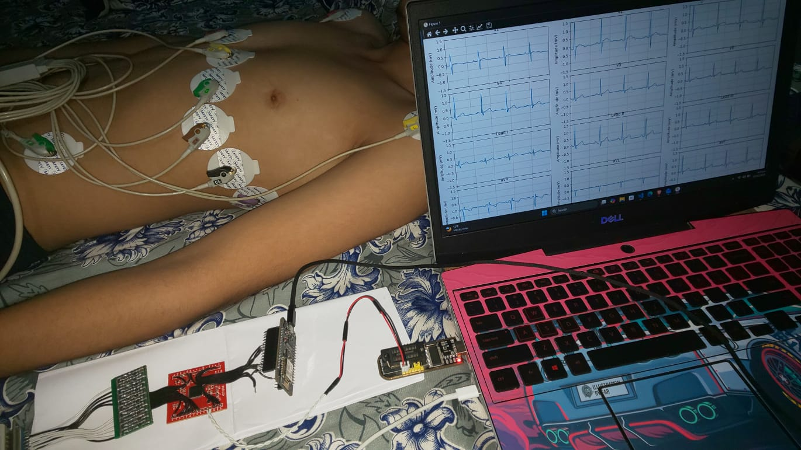
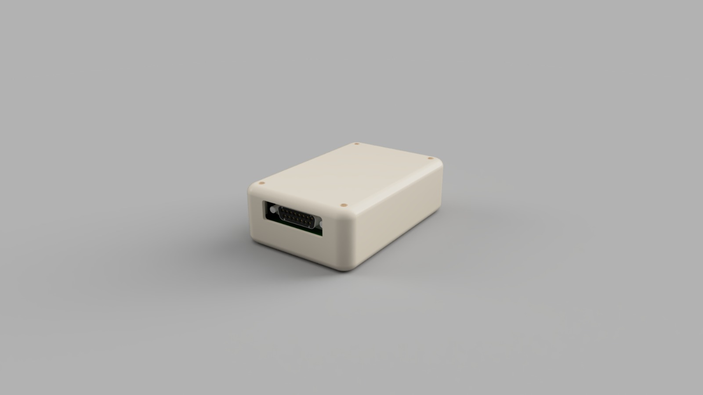

# 🫀 Portable High-Fidelity ECG System (ADS1298 + ESP32)

> **Role:** Embedded Systems & Hardware Engineer
> **Status:**
> * ✅ **Phase 1:** Functional Prototype (Manufactured & Tested)
> * 🚧 **Phase 2:** Industrial Design (Ready for Manufacturing - IEC 60601-1 Compliant)

## 🎯 Project Summary
This project is a clinical-grade 12-lead ECG monitor. I built and verified a functional prototype using the **Texas Instruments ADS1298** (24-bit AFE) to acquire biopotential signals. Following successful validation, I developed a Revision 2 design optimized for mass production and medical safety standards.

**Key Features:**
* **Signal Integrity:** 4-layer PCB designed to minimize noise in microvolt-level signals.
* **Real-Time Processing:** Digital filtering on ESP32 to remove 50Hz noise without signal distortion.
* **Medical Compliance:** Hardware designed to meet **IEC 60601-1** safety standards.

---

## 📸 Engineering Showcase

### Phase 1: Validated Prototype (Manufactured)
*Physical hardware verification. This unit was built, soldered, and tested on human subjects.*

**[▶️ CLICK TO WATCH: Real-Time 12-Lead Acquisition Video](hardware/prototype-v1/validation/ECG_Results.mp4)**

| Test Setup (HIL) | Clinical Lead Placement |
| :---: | :---: |
|  |  |

### Phase 2: Production Concept (Design Only)
*Advanced 4-layer PCB and mechanical enclosure designed for IEC 60601-1 compliance. Ready for fabrication.*

**[▶️ CLICK TO WATCH: Assembly Simulation](hardware/ProductConcept/mechanical-design/Concept_Product%20_Design.mp4)**

| Test Setup (HIL) | Clinical Lead Placement |
| :---: | :---: |
|  |  |
|  |  |
                                                                                    
---

## 🛠️ Tech Stack
* **Hardware:** Altium Designer, 4-Layer Stackup, ADS1298 AFE
* **Firmware:** C/C++, PlatformIO, ESP32 (Dual Core), SPI DMA
* **Mechanical:** Fusion 360, 3D Printing

## 📂 Repository Navigation
* [**`/firmware`**](./firmware) - C++ source code for ADS1298 driver and ESP32 interrupts.
* [**`/hardware/prototype-v1`**](./hardware/prototype-v1) - Artifacts from the initial functional prototype.
* [**`/hardware/ProductConcept`**](./hardware/ProductConcept) - Design files for the IEC-compliant production version.
