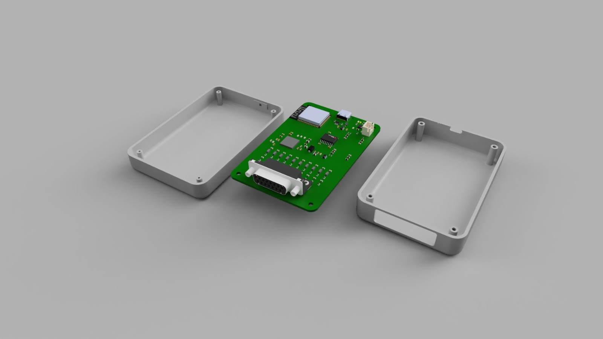
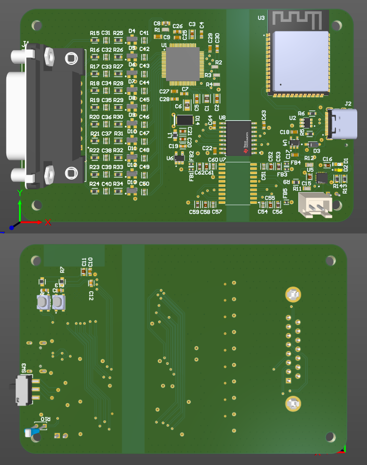

# 🛡️ Revision B: Industrial Design Concept

**Status: 📝 DESIGN COMPLETE (Ready for Tooling)**

This revision represents the "Design for Manufacturing" (DFM) phase. It upgrades the tested V1 circuit into a 4-layer architecture suitable for medical safety certification.

## 4-Layer PCB Strategy
1.  **Top Layer:** High-speed Digital Signals (SPI) & Components.
2.  **Layer 2 (GND):** Solid Ground Plane for EMI shielding.
3.  **Layer 3 (PWR):** Power Plane (3.3V Analog/Digital distribution).
4.  **Bottom Layer:** Sensitive Analog Traces (Shielded by internal planes).

### Mechanical Integration
The enclosure is designed for 3D Printing with specific attention to patient isolation.

| Rendered Enclosure | PCB Stackup |
| :---: | :---: |
|  |  |

**[▶️ Click here to watch the Assembly Explosion Video](mechanical-design/Concept_Product%20_Design.mp4)**
