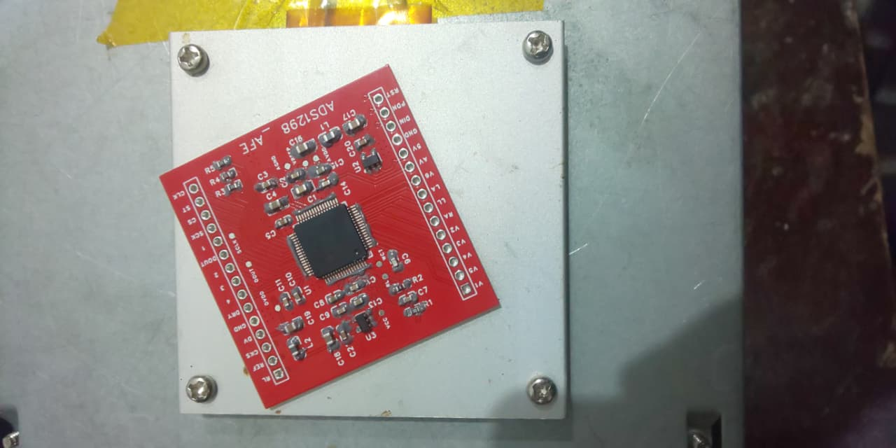
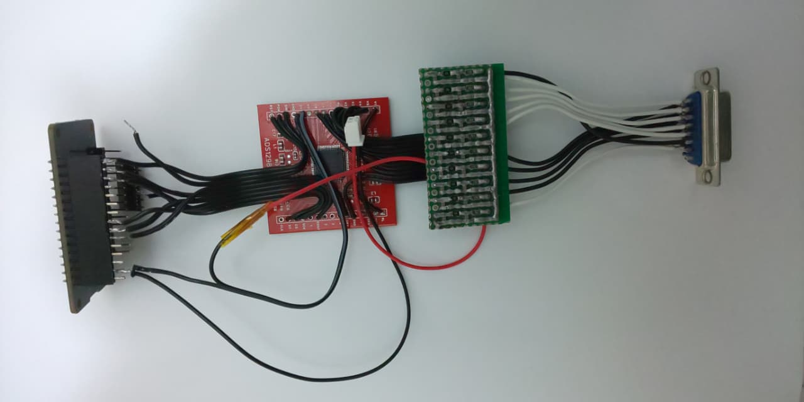
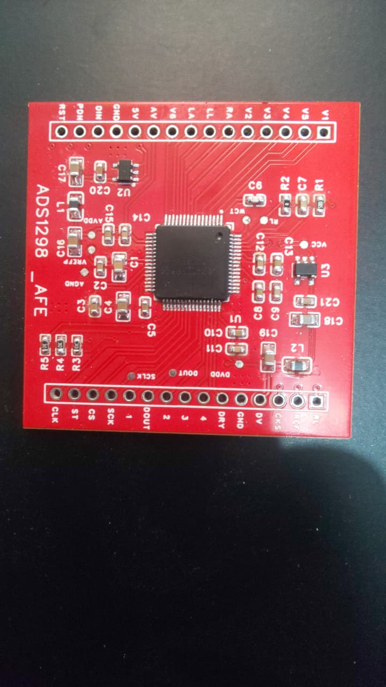
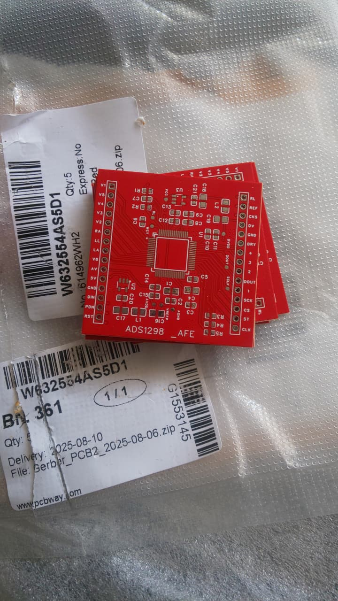

# 🛠️ Revision A: Functional Prototype

**Status: ✅ VERIFIED**

This revision successfully demonstrated the acquisition of the P-QRS-T complex with minimal baseline wander.

### Validation Artifacts
* **Input:** 12-Lead standard electrode placement (Ra, La, RL, LL, V1-V6).
* **Output:** Streamed via Serial Plotter at 500Hz.
* **Noise Floor:** < 20uV (post-filtering).

### Assembly Evidence
The ADS1298 (TQFP-64) was hand-soldered using hot air reflow.

| Manual Soldering | Wiring Harness |
| :---: | :---: |
|  |  |

| Assembled Board | Bare PCBs |
| :---: | :---: |
|  |  |
